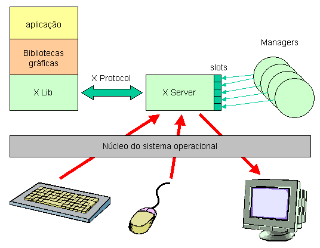
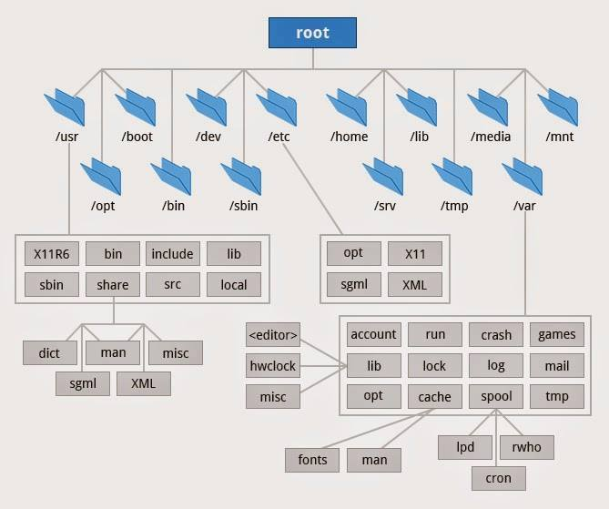

# Conceitual

---

# Sobre o Linux

## Sessão
O uso de Linux se baseia na noção de sessão de trabalho. Cada usuário é designado por um nome de login, ou simplesmente login, com uma senha secreta associada. Uma sessão de trabalho típica consiste das seguintes etapas:

* O usuário identifica-se, fornecendo seu nome de login e sua senha ao sistema.

* A sessão de trabalho inicia, com o lançamento do shell (modo texto) ou do ambiente (modo gráfico).

* Uso do sistema (lançamento de comandos e aplicações).

* Fim da sessão (operação de logout ou logoff).

O Linux pode gerenciar diversas sessões simultâneas de usuários distintos na mesma máquina. Cada um terá uma visão independente e transparente dos recursos disponíveis, sem conflitos ou interferências.

## Conceito de Interface Gráfica

No Linux a interface gráfica é completamente separada do núcleo do sistema operacional. Isso permite uma grande versatilidade em relação aos ambientes gráficos disponíveis. A interface gráfica é construída em dois níveis:

* O servidor gráfico X-Window, que oferece as funcionalidades gráficas básicas, gerência entidades básicas como regiões de tela e trata eventos relacionados à interface (como operações de mouse e teclado).

* O ambiente de trabalho, composto por vários processos, que implementam a decoração das janelas, menus, ícones, desktops virtuais, etc.

Entretando o foco desta documentação e a utilização do sistema em servidor, devido a isso ele não contara com Ambiente Grafico, a principio a "SHELL" usada será o SHELL.

## Shell 

O shell é um programa que permite o uso do sistema através de uma interface em linha de comandos. Existem diversos estilos de shell, sendo os mais comuns o Bourne Shell (sh) e o C-Shell (csh). Esse shell foi escolhido por alias simplicidade e facilidade de uso com uma grande versatilidade.

Apesar da interface em linha de comandos ser um conceito considerado antiquado, o shell oferece mecanismos para tornar a vida do usuário muito simples e produtiva. Além disso, é uma ferramenta de valor inestimável para operações em máquinas remotas.

## Estrutura de arquivos hierárquico

O **Filesystem Hierarchy Standard** (padrão para sistema de arquivos hierárquico), ou FHS, define os principais diretórios, e o seu conteúdo, em um sistema operacional Linux ou do tipo Linux. A versão atual é a 3.0, anunciada em 3 de junho de 2015.

No início do ano de 1996, surgiu um movimento, com o apoio da comunidade de desenvolvedores do BSD, que visava o desenvolvimento de versões do FSSTND para outros sistemas do tipo Linux, além do Linux. A partir desta iniciativa foi realizado um esforço para determinar os problemas comuns aos sistemas do tipo Linux. Como resultado da ampliação do escopo do problema, o nome do padrão foi alterado para Filesystem Hierarchy Standard (FHS) (padrão para sistemas de arquivo hierárquicos).

O FHS é mantido pela Linux Foundation, uma organização sem fins lucrativos formada por importantes empresas de hardware e software, como HP, Red Hat, IBM e Dell. Ainda hoje, algumas maiorias das distribuições Linux, incluindo membros da Linux Foundation, não adotam o padrão proposto. Em particular, diretórios (paths) criados pelo FHS, como o /srv/, não foram adotados em grande escala. Alguns sistemas Linux e Linux rompem com o padrão FHS, como o GoboLinux. O Mac OS X utiliza uma estrutura com nomes legíveis por seres humanos em conjunto com um sistema baseado no FHS.

O sistema de arquivos do Linux possui as seguintes características fundamentais:

* É estruturado na forma de uma árvore única, iniciando pelo diretório “/”, que é chamado de “raiz”.

* Há suporte para arquivos, diretórios e links (atalhos).

* Os arquivos podem ter qualquer nome, usando quaisquer caracteres, com distinção entre maiúsculas e minúsculas. Os nomes são normalmente limitados a 255 caracteres.

* O caracter é separador de diretórios é o “/” (barra).

* Arquivos e diretórios cujos nomes começam com “.” (ponto) são considerados “ocultos” e normalmente não aparecem nas listagens de diretórios.

* As extensões são normalmente usadas apenas para facilitar a vida do usuário, mas não são importantes para o sistema operacional, que não depende delas para identificar o conteúdo de um arquivo.

* Os arquivos e diretórios possuem permissões de acesso controláveis por seus proprietários.

## Principais diretórios

Os diretórios de um sistema de arquivos Linux têm uma estrutura pré-definida, com poucas variações, alguns podem ser configurados durante a instalação para terem pontos de montagem separado do restante do sistema, conforme lista abaixo.

Partição | Descrição
--|--
/home| raiz dos diretórios home dos usuários.
/boot| arquivos de boot (núcleo do sistema, etc)
/var| arquivos variáveis, áreas de spool (impressão, e-mail, news), arquivos de log
/etc| arquivos de configuração dos serviços
/usr| aplicações voltadas aos usuários
/tmp| arquivos temporários
/mnt| montagem de diretórios compartilhados temporários
/bin| aplicações de base para o sistema
/dev| arquivos de acesso aos dispositivos físicos e conexões de rede
/lib| bibliotecas básicas do sistema

## Gerenciamento de volumes lógicos (LVM)

É um mapeador de dispositivos que fornece gerenciamento de volume lógico para o kernel do Linux, tem como função gerar camadas de volume lógico entre sistema operacional e disco rígido, as quais se comportam como partições. A maioria das distribuições Linux modernas dão suporte ao LVM ao ponto de serem capazes de possuir seus sistemas de arquivo raízes em um volume lógico. Trata-se de um método de alocação de espaço. 

O LVM cria um bloco que tem a função de disco rígido (mais próximo de um disco dinâmico), o qual armazena grupos de volumes cuja capacidade é configurada pelo usuário.

Por fim, volumes lógicos são acrescentados aos grupos para que eles armazenem dados.

### Principais vantagens do LVM
Quando se tem um conjunto de volumes lógicos para manipular o espaço de disco, é certo que diversas vantagens ficam à disposição do usuário — vejamos três delas.

1. Redimensionamento de partições – diferentemente de uma partição convencional, um volume criado com o LVM pode ser redimensionado a qualquer momento usando apenas uma linha de comando. Isso traz uma enorme flexibilidade para gerenciar o seu disco.

2. Utilização de discos paralelos – Se você possui uma máquina com múltiplos discos rígidos instalados (três, por exemplo), você consegue aproveitar a capacidade de todos eles para criar uma unidade lógica centralizada. Assim, é possível criar volumes escaláveis.

3. Snapshots – A função de snapshots é um grande atrativo do LVM, pois ela permite ao usuário criar cópias do volume lógico no estado em que este se encontra no momento. Por meio dos snaps é possível criar backups instantâneos, realizar testes etc.

Podemos citar outras vantagens, como: flexibilidade, escalabilidade, menor tempo de outage (menos tempo de sistema parado), melhor gerenciamento e redução de custos 

#### Estrutura do LVM
Para compreendermos como funciona o LVM primeiro precisamos conhecer a sua estrutura e como funciona, logo abaixo irei explicar a sua estrutura.

• Physical Volume (PV) – são os HDs ou qualquer outro dispositivo de armazenamento;

• Volume Group (VG) – é a reunião dos HDs;

• Physical Extent) (PE) - Quando um PV é inserido em um VG o LVM o divide em várias partes de tamanho igual e essas partes são associadas a uma LE (Logical Extent), o menor valor de alocação dentro de um VG (do ponto de vista do LVM);

• Logical Volume (LV) – São volumes lógicos que você pode redimensionar a capacidade de forma dinâmica. Esse elemento é uma área de alocação das LE, na qual criamos o filesystem, que podemos manipular ou criar o sistema de arquivos, já criado ele nos atribuí um device para que possamos montar, e segue a seguinte lógica: /dev/nome-do-vg/nome-do-lv.

# Sistemas de arquivos
~~~~
EXT4 ->

BTRF ->

ZFS (apenas BSD) ->

XFS ->
~~~~

# Inicialização (BIOS ou UEFI)
~~~~
    BIOS - > grava diretamente no disco, não e necessario a criação de partição exclusiva;
    
    UEFI -> necessita de uma partição para inicia o sistema operacional +/- de 1GB, localizado no inicio do disco;
~~~~

---
 
# Hora da Pratica

# Instalação 

Debian netinstall

nonfree -> são os softwares que não tem licença livre;

**1.** Modo texto;

No debian apertando o ALT+F4 é possível acompanhar os log's durante a instalação.

...

**2.** Configurar a rede
    * hostname - nome fácil de identificar, baseado na função do servidor;

**3.** Configurar o usuário e senha;
    * Conta do root;
    * Conta de administrador;

**4.** Configurar o relógio;

**5.** Particionar Discos;

As partições variam de acordo com a função do servidor.

**5.1** - Salvar como: **Sistema de arquivos**

Todos sistemas Linux tem: 
Item | Caracteristicas 
----|--
Tabela de Inodos| Tabela de incides de arquivos, contem: dono, grupo, permissões, atributos, datas e bloco que está locado.
Super-blocos |
Área de dados|
Journaling| área de meta dados

## Sistemas de arquivos
~~~~
EXT4 ->

BTRF ->

ZFS (apenas BSD) ->

XFS ->
~~~~

**5.2** - **Ponto de montagem**

**5.3** - **Opções de montagem**

Item | Descrição
--|--
discard (uso em SSD)|
noatime (reduz o uso da agulha do HD) | não atualiza datas de acesso de inode a cada acesso
nodiratime | não atualiza datas de acesso de inode de diretorio

**5.4** Bloco reservado para o root
Caso o armazenamento fique super lotado o usuário root possa logar e realizar a manutenção.

**6.** Configuração do gerenciador de pacotes
 
Escolher a localização mais proxima para fazer o downlaod dos pacotes

**7.** tasksel

Menu de para instalações de softwares durante a instalação: ambientes gráficos, Servidor web, Servidor de impressão, **Servidor SSH** e **Utilitários de sistema padrão**

**8.** Sistema de inicialização (grub)

Instalar o grub no armazenamento.

## Primeira inicializações

1. Atualização do sistema

~~~~shell
# apt update

# apt upgrade
~~~~

2. Verificar a estrutura do sistema

~~~~shell
# df -Th
~~~~

3. Analizar os itens inicializando

Na primeira inicialização alguns itens demoram mais a iniciar devido a estarem sendo configurados.

~~~~shell
# systemd-analyzer blame

# systemctl disable apparmor.service 'não ira iniciar no boot'

# systemctl stop apparmor.service 'para o serviço, mas ele ainda inicia no boot'
~~~~

4. Sincronizar itens de leitura e/ou escrita

~~~~shell
# sync
~~~~

5. Reiniciando o sistema

~~~~shell
# reboot
~~~~

----
Pode acontecer de alguns comandos não funcionarem, isso pode ser pelo fato do path não ter sido carregado.

~~~~shell
# echo $PATH
# export PATH="PATH:/usr/local/bin:/usr/bin:/bin:/usr/local/games:/usr/games:/sbin:/usr/sbin:/usr/local/sbin"
~~~~

Tornar permanente a alteração, inserindo o comando nas configurações do ambiente.

~~~~shell
nano /etc/environment
    export PATH="PATH:/usr/local/bin:/usr/bin:/bin:/usr/local/games:/usr/games:/sbin:/usr/sbin:/usr/local/sbin"
~~~~

----

6. habilitar comunicação entre placas de rede

Deve ativar o ip_forward, descomentado a linha

~~~~shell
# nano /etc/systtl.d/99-sysctl.conf
~~~~

7. Acessos ao sistema

7.1. Ajustes no SSH
alterar alguns parametros,como:

~~~~shell 
# nano /etc/ssh/sshd_conf
~~~~

* Port;
* ListenAddress;
* LoginGraceTime, colocar segundo. Ex.: 45s;
* PermitRootLogin no;
* MaxSessions 3;
* X11Forward no, o servidor não possui ambiente gráfico *X11*;
* UseDNS no;
* MaxStartUps (quantidade maxima de inicialização de conexão) 5:70:10, **5** tentativas que não conseguiu se conectar, bloqueie **70**% das tentativas, **10** não autenticas bloquear todas as tentativas
* AllowUsers xYz, apenas o usuário xYz pode conectar via ssh;
* AddressFamily inet, só IPv4; 

---
---

# Comandos

