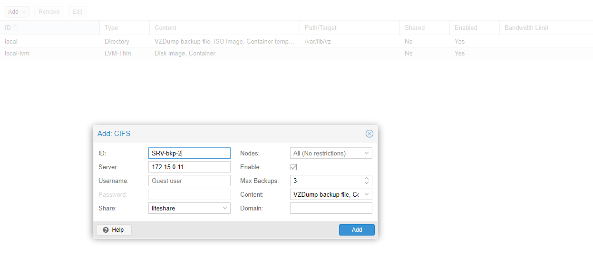
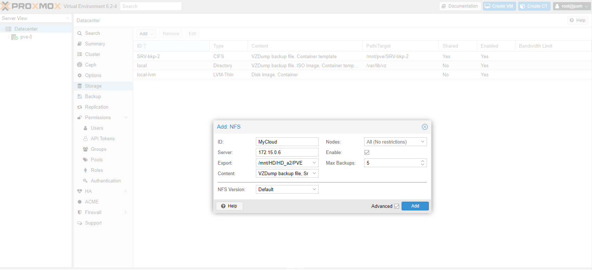

## Hardware dos Nodes

Item | Node -0 | Node - 1 | node - 2
----|-|-------|----
placa-mãe | | DL380 G7 | S1200RP_SE
CPU | | Intel(R) Xeon(R) CPU E5506 @ 2.13GHz |Intel(R) Xeon(R) CPU E3-1231 v3 @ 3.40GHz
Memorias  **ECC** | | 24GiB - 6 pentes -> 4GiB DIMM DDR3 Synchronous 1333 MHz | 8GB - 1 pente -> DIMM DDR3 Synchronous 1600 MHz
Placa de Rede | | 4 - NetXtreme II BCM5709 Gigabit Ethernet + 2 Offboard | 2 onboard - I210 Gigabit Network Connection
Armazenamento | |LVM (S.O.) 278.86GiB + ZFS (VM's e CT) |
HD's | | 4 SAS de 300GB | ST1000DM003-1ER1 (1TB) + ST3120026AS (120GB) + WDC WD2500AAKX-7 (250GB) +  WDC WD2500AAKX-7 (250GB) + WDC WD2500AAKX-7 (250GB) + WDC WD2500AAKX-7 (250GB) +

### Restart webinterface
service pveproxy status 

# processo de recuperação de queima de HD 25/10/2020
https://lucatnt.com/2019/11/moving-proxmox-zfs-boot-drive-to-a-new-disk/

para tentar recuperar a plataforma 
https://forum.proxmox.com/threads/how-to-restore-a-container-when-the-container-conf-is-lost.66002/

https://forum.proxmox.com/threads/how-to-migrate-a-virtual-machine-image-into-local-lvm.28751/

https://pve.proxmox.com/wiki/Root_Password_Reset#Resetting_the_root_account_password_in_a_Container

## Ativando SMNP´

O Proxmox por ser tratar de uma distribuição baseada no Debian tem sua ativação realizada através  da instalação dos pacotes “.deb” pelo comando, ``apt install snmpd lm-sensors snmptrapd`` tendo o pacote instalado e necessário a configuração o arquivo “smnpd.conf”:

1. Criar o backup do arquivo smnpd.conf, ``mv /etc/snmp/snmpd.conf /etc/snmp/snmpd.conf.ori``;

2. Criar um arquivo smnpd.conf, nano smnpd.conf;
~~~~shell

    # this create a  SNMPv1/SNMPv2c community named "my_servers"
    # and restricts access to LAN adresses 192.168.0.0/16 (last two 0's are ranges)
    rocommunity public 172.15.0.0/16
    # setup info
    syslocation  "CPD"
    syscontact  "semed.ni.ti@gmail.com"
    # open up
    agentAddress  udp:161
    # run as
    agentuser  root
    # dont log connection from UDP:
    dontLogTCPWrappersConnects yes
    # fix for disks larger then 2TB
    realStorageUnits 0

~~~~
       
3. Ativar exceção no firewall, ``iptables -A INPUT -s 172.15.0.0/16 -p udp --dport 161 -j ACCEPT``;
4. Reiniciar o  daemon do SMNP, ``service snmpd restart``;
5. Tornar o protocolo ativo por padrão, ``update-rc.d snmpd enable``.

~~~~shell
# nano /etc/apt/sources.list
    deb http://deb.debian.org/debian stretch main contrib non-free
    deb-src http://deb.debian.org/debian stretch main contrib non-free

    deb http://security.debian.org/debian-security/ stretch/updates main contrib non-free
    deb-src http://security.debian.org/debian-security/ stretch/updates main contrib non-free

    deb http://deb.debian.org/debian stretch-updates main contrib non-free
    deb-src http://deb.debian.org/debian stretch-updates main contrib non-free

# apt update

# apt-get install snmp-mibs-downloader
~~~~

## Local das ISO's
/var/lib/vz/template/iso/

## Storage Externo

Para adicionar armazenamento externo é preciso acessar no *Datacenter -> Storage -> Add* e escolher o tipo de armazenamento.

### CIFS
Nesse exemplo vou utilizar outra maquina, usando o LinuxLite com o Samba, para hospedar os backups.

+ ID -> Nome do instância do compartilhamento, pode ser qualquer um;

+ Server -> Endereço do servidor, usei o IP, com o DNS configurado no servidor poderia ser usado o nome;

+ Username e Password -> caso o compartilhamento sejá por autenticação;

+ Share -> pasta compartilhada;

+ Nodes-> Para criação de restrição de uso no storage por determinado *node*;

+ Enable -> habilitado;

+ Max Backups -> quantidade de Backups que serão armazenados no servidor;

+ Content -> são os itens que serão armazenados nos servidor, nesse caso *VZDump backup file* e *Container template*;

+ Domain -> ???????

### NFS

## Instalação do Certificado

Para aparecer mais a tela de erro de certificado no navegador é preciso instalar o certificado ssl do servidor PVE

Com o FileZilla copiei o arquivo /etc/pve/pve-root-ca.pem